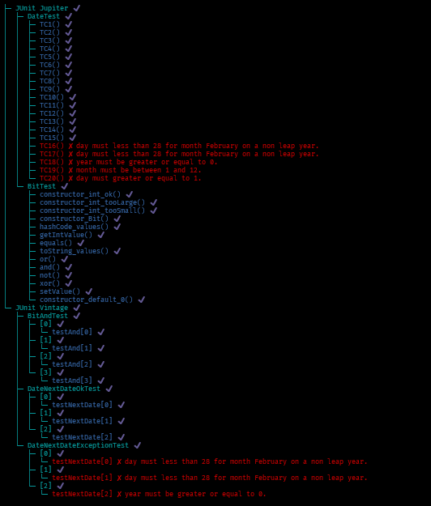

# Lab 2

## Exercise 1

| Testcase    | Expected Results | Actual Results | Verdict (Pass, Fail, Inconclusive) |
| -------- | ------- | -------- | -------- |
| Username: John123   First name: John   Last name: Doe   Email: example@test.com   Age: 24   City: Ottawa   Postal code: K1N 1N2  | Valid registration    |  Registration valid    |  Pass    |
| Username: 123John   First name: John   Last name: Doe   Email: example@test.com   Age: 24   City: Ottawa   Postal code: K1N 1N2  | Wrong UserName format    |  Wrong UserName format |  Pass    |
| Username: John123   First name: 123   Last name: Doe   Email: example@test.com   Age: 24   City: Ottawa   Postal code: K1N 1N2  | Wrong FirstName format    |  Wrong FirstName format |  Pass    |
| Username: John123   First name: John   Last name: 123   Email: example@test.com   Age: 24   City: Ottawa   Postal code: K1N 1N2  | Wrong LastName format    |  Wrong LastName format |  Pass    |
| Username: John123   First name: John   Last name: Doe   Email: example   Age: 24   City: Ottawa   Postal code: K1N 1N2  | Wrong Email format    |  Wrong Email format |  Pass    |
| Username: John123   First name: John   Last name: Doe   Email: example@test.com   Age: abc   City: Ottawa   Postal code: K1N 1N2  | Wrong Age format    |  	Failed to convert property value of type java.lang.String to required type java.lang.Integer for property age; nested exception is java.lang.NumberFormatException: For input string: "abc" |  FAIL    |
| Username: John123   First name: John   Last name: Doe   Email: example@test.com   Age: 17   City: Ottawa   Postal code: K1N 1N2  | 	must be greater than or equal to 18    |  		must be greater than or equal to 18 |  Pass    |

## Screenshots

 