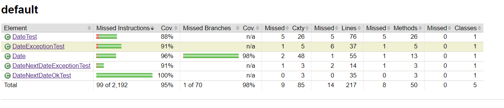

# Lab 3

It is impossible to get 100% test coverage as in the `isEndOfMonth` method, the condition `(day == 31 || (day == 30 && isThirtyDayMont()) || (this.month == 2 && ((day == 29 && leap) || (day = 28 && !leap))))` cannot be fully covered. This is because it is impossible to have `leap = false` and `!leap = false` at the same time.

Test coverage did not change after refactoring the condition mentioned above in the `Date` class. I was still unable to cover 1 out of the 6 branches in the `this.month == 2 && day == 29 && leap` sub-condition.

`Date`'s coverage after adding tests and refactoring: 
